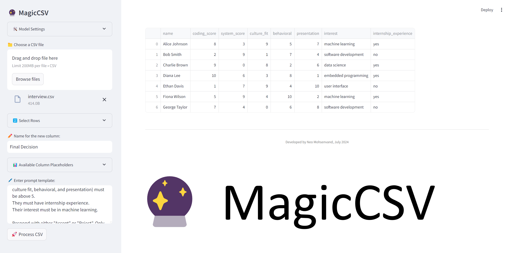

# 🔮 MagicCSV

MagicCSV is a simple and fully open-source application that leverages local LLMs to add a new column to your CSV files using customizable prompts. The app utilizes prompts to merge data from columns in a customized manner, offering a user-friendly alternative to traditional spreadsheet formulas. With MagicCSV, you can go beyond formulas and do things like translating to different languages, summarizing data, qualitative analysis, and pretty much anything a large language model can do. You can add columns iteratively and use previously generated columns in your new prompts.

## 🎥 Demo Video

[](https://youtu.be/y3QHEWODAnM)

## 🚀 Quick Start (for Users)

1. Download the `MagicCSV.exe` from the `./dist` folder.
2. Ensure Ollama is installed and running on your system. 
3. Make sure you have pulled at least one model from Ollama.
4. Double-click `MagicCSV.exe` to launch the application.
5. Upload your CSV, configure settings, and process your data!

## 🛠️ Model Settings
These Ollama parameters can be adjusted.  
| Parameter      | Description                                                                                                                                                                                                                                             | Value Type | Example Usage        |
| -------------- | ------------------------------------------------------------------------------------------------------------------------------------------------------------------------------------------------------------------------------------------------------- | ---------- | -------------------- |
| mirostat       | Enable Mirostat sampling for controlling perplexity. (default: 0, 0 = disabled, 1 = Mirostat, 2 = Mirostat 2.0)                                                                                                                                         | int        | mirostat 0           |
| mirostat_eta   | Influences how quickly the algorithm responds to feedback from the generated text. A lower learning rate will result in slower adjustments, while a higher learning rate will make the algorithm more responsive. (Default: 0.1)                        | float      | mirostat_eta 0.1     |
| mirostat_tau   | Controls the balance between coherence and diversity of the output. A lower value will result in more focused and coherent text. (Default: 5.0)                                                                                                         | float      | mirostat_tau 5.0     |
| num_ctx        | Sets the size of the context window used to generate the next token. (Default: 2048)                                                                                                                                                                    | int        | num_ctx 4096         |
| repeat_last_n  | Sets how far back for the model to look back to prevent repetition. (Default: 64, 0 = disabled, -1 = num_ctx)                                                                                                                                           | int        | repeat_last_n 64     |
| repeat_penalty | Sets how strongly to penalize repetitions. A higher value (e.g., 1.5) will penalize repetitions more strongly, while a lower value (e.g., 0.9) will be more lenient. (Default: 1.1)                                                                     | float      | repeat_penalty 1.1   |
| temperature    | The temperature of the model. Increasing the temperature will make the model answer more creatively. (Default: 0.8)                                                                                                                                     | float      | temperature 0.7      |
| seed           | Sets the random number seed to use for generation. Setting this to a specific number will make the model generate the same text for the same prompt. (Default: 0)                                                                                       | int        | seed 42              |
| stop           | Sets the stop sequences to use. When this pattern is encountered the LLM will stop generating text and return. Multiple stop patterns may be set by specifying multiple separate `stop` parameters in a modelfile.                                      | string     | stop "AI assistant:" |
| tfs_z          | Tail free sampling is used to reduce the impact of less probable tokens from the output. A higher value (e.g., 2.0) will reduce the impact more, while a value of 1.0 disables this setting. (default: 1)                                               | float      | tfs_z 1              |
| num_predict    | Maximum number of tokens to predict when generating text. (Default: 128, -1 = infinite generation, -2 = fill context)                                                                                                                                   | int        | num_predict 42       |
| top_k          | Reduces the probability of generating nonsense. A higher value (e.g. 100) will give more diverse answers, while a lower value (e.g. 10) will be more conservative. (Default: 40)                                                                        | int        | top_k 40             |
| top_p          | Works together with top-k. A higher value (e.g., 0.95) will lead to more diverse text, while a lower value (e.g., 0.5) will generate more focused and conservative text. (Default: 0.9)                                                                 | float      | top_p 0.9            |
| min_p          | Alternative to the top_p, and aims to ensure a balance of quality and variety. The parameter *p* represents the minimum probability for a token to be considered, relative to the probability of the most likely token. For example, with *p*=0.05 and the most likely token having a probability of 0.9, logits with a value less than 0.045 are filtered out. (Default: 0.0) | float      | min_p 0.05            |

## 📄 Writing a prompt
To refer to a column in your prompt, simply type **@** and start typing the name of the column. The app will automatically show you the existic column names in an autocomplete dropdown. Select the desired column. The app will automatically put square brackets around the column name to avoid issues with column names that have spaces or special characters.

## 🛠️ Development Setup

### Running the Streamlit App

1. Clone the repository:

```console
git clone https://github.com/neovand/MagicCSV.git
cd MagicCSV
```

2. Create and activate a virtual environment:

```console
python -m venv venv
source venv/bin/activate  # On Windows use `venv\Scripts\activate`
```

3. Install dependencies:

```console
pip install -r requirements.txt
```
4. Run the Streamlit app:

```console
streamlit run app.py
```

### Building the Executable

1. Install PyInstaller:
```console
pip install pyinstaller
```

2. Build the executable:
```console
pyinstaller run.spec --clean
```

## 📝 Todo
- [x] Ollama Integration
- [x] Build for Windows
- [x] Implement intuitive column referencing with @mentions
- [ ] OpenAI, Anthropic, Groq Integration
- [ ] Build for Mac and Linux
- [ ] Add batch processing capabilities
- [ ] Implement prompts that can access other rows, not just the current row
- [ ] Add support for more file formats (e.g., Excel, JSON)
- [ ] Implement error handling and logging
- [ ] Create user documentation and usage examples